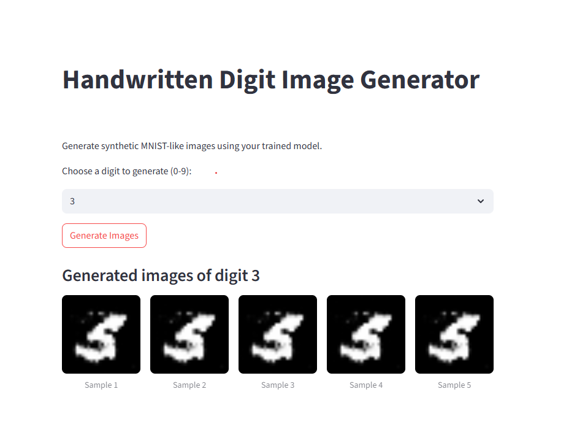

# Handwritten Digit Image Generator

[][https://mnist-generator-app-nokjarnuyxqxhywalprhkh.streamlit.app/]


A web application that uses a Conditional Generative Adversarial Network (cGAN) to generate synthetic, high-quality images of handwritten digits (0-9).



## 📜 Project Overview

This project demonstrates the power of generative models by allowing users to generate images of a specific digit on demand. Unlike a standard GAN that produces random digits, a **Conditional GAN (cGAN)** is used here, which takes a condition (the desired digit) as an additional input to guide the image generation process.

The model was trained from scratch on the classic MNIST dataset using PyTorch and deployed as an interactive web application with Streamlit.

## ✨ Features

- **Digit Selection:** Choose any digit from 0 to 9 using a simple dropdown menu.
- **On-Demand Generation:** Click the "Generate Images" button to get new results.
- **Unique Images:** The app generates 5 unique, never-before-seen images of the selected digit with each click.

## 🚀 Live Demo

You can access and interact with the live application here:

**[Handwritten Digit Image Generator][https://mnist-generator-app-nokjarnuyxqxhywalprhkh.streamlit.app/]**

## 🛠️ Tech Stack & Tools

- **Model Framework:** PyTorch
- **Web Application:** Streamlit
- **Dataset:** MNIST
- **Training Environment:** Google Colab (with T4 GPU)
- **Deployment:** Streamlit Community Cloud
- **Version Control:** Git & GitHub

## 🧠 Model Architecture

The core of this project is a **Conditional Generative Adversarial Network (cGAN)**, which consists of two neural networks competing against each other:

1.  **The Generator:** Its goal is to create realistic-looking images of digits. It takes a random noise vector and a condition (the digit's label, e.g., "7") as input and outputs a 28x28 grayscale image.
2.  **The Discriminator:** Its goal is to act as a detective, determining whether an image is a real one from the MNIST dataset or a fake one created by the Generator. It also considers the digit's label to ensure the Generator is creating the *correct* digit.

Through training, the Generator becomes better at fooling the Discriminator, resulting in a model that can produce high-quality, convincing images of any specified digit.

## ⚙️ Setup and Local Installation

To run this project on your local machine, follow these steps:

1.  **Clone the repository:**
    ```bash
    git clone https://github.com/Bini-fish/mnist-generator-app.git
    cd [mnist-generator-app]
    ```

2.  **Create a virtual environment (recommended):**
    ```bash
    python -m venv venv
    source venv/bin/activate  # On Windows, use `venv\Scripts\activate`
    ```

3.  **Install the required dependencies:**
    ```bash
    pip install -r requirements.txt
    ```

4.  **Run the Streamlit application:**
    ```bash
    streamlit run app.py
    ```
